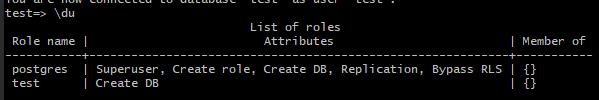

# 部署mixin Message 大群笔记

使用scp命令传送文件到linux服务器
scp zcvf key.tar.gz root@xxxxx:/etc/nginx/conf.d/

#### 打包
 tar -zcvf ../db.tar.gz ./
#### 上传
  scp zcvf db.tar.gz root@xxxxx:/home/xxx
#### 解压
tar xvf db.tar.gz

今天部署了go写的一个web应用到linux服务器上,和javaWeb需要Apache Tomcat node.js需要pm2 不同的是,
go编译通过之后,直接文件名就可以运行,这也太爽了


#### 在部署的过程中出现了几个问题:
1. window的换行符和linux下的换行符不一样 window下使用\n\r linux只用\r
        
    [vim下处理文档中的\r\n\t字符 - 问题与解决 - SegmentFault 思否](https://segmentfault.com/a/1190000010605053?utm_source=tag-newest)

2. go build 解决国内无法拉取依赖的问题
    go env -w GOPROXY=https://goproxy.cn,direct
    
3. 不熟悉postgreSQL在执行sql语句完成的状态 '=>' 与 '->' 的时候忘了加';'而导致执行失败之后状态不一样都没注意到 
    
### 记录下使用到的命令
* systemd   
* journalctl 查看日志
* netstat -langput | grep LISTEN 查看端口
* 


从昨天一直在尝试,询问了相关开发人员后,得到的回复是host应该是一个url而不是api那么这个host到底是哪里配置的,只能是config.yaml中配置的,更改host配置后点击之后一直返回一条json信息
```json
{"data":{"build":"BUILD_VERSION-go1.13.8","developers":"https://developers.mixin.one"}}
```
直到今天,才发现需要重新从对话中返回一个新的按钮,才能生效,而这里到一个链接  
这个链接据猜测应该是一个授权或者付款页面,点击按钮后,并返回son对象

使用浏览器调试group.test.com


### linux 常用命令
数据库报错了需要查询日志文件,但是不知道文件存在哪个位置用到了locate这个命令

whereis 和 locate 是用来查找文件的

which 和 type 是查找命令的

[Mixin 大群部署完全教程 – Exin 团队博客](https://blog.exin.one/2019/05/25/mixin-super-group/)


### postgresql 基本操作
postgres是在linux安装postgreSQL 自动创建的一个Superuser下图说明了一些Superuser的一些权限

   

* \\? help
* \l show databases
* \dt show tables
* \d 与\dt区别是什么？
* \c dbname 切换到新数据库
* \c show current DB name and user
* \conninfo 显示客户端的连接信息
* \d table_name describ table
* \du list all roles

### metacognition
   1. mixin大群本身就是一个机器人,可以学习机器人的写法,使用的是go语言,是通过阅读源码提升自己很好的一个案例
   
### finished
   1. 部署完成mixin大群
   2. 并找到了一个bug,并通知相关人员修复
### difficulty
   go语法不太熟悉
### review
   回顾了一些linux的操作命令
### view
   postgreSQL的基本知识
### preview
   慢慢回顾go语言基本语法
   
  ## 使用ip + 端口号配置
```yaml
server {
    # listen 443 ssl http2;
    listen 80;
    #server_name group.test.com;
    server_name 1xx.1xxx.1xxx.xxx;
    # ssl on;
    # ssl_certificate /etc/nginx/conf.d/cert/group.test.com_bundle.crt;
    # ssl_certificate_key /etc/nginx/conf.d/cert/group.test.com.key;
    # ssl_session_timeout 5m;
    # ssl_protocols TLSv1 TLSv1.1 TLSv1.2;
    # ssl_ciphers xxxxxxxx;
    # ssl_prefer_server_ciphers on;

    root /var/www/test/dist;
    index index.html index.htm;
    charset utf-8;

    gzip            on;
    gzip_comp_level 5;
    gzip_min_length 256;
    gzip_proxied    any;
    gzip_types
      application/atom+xml
      application/javascript
      application/json
      application/ld+json
      application/manifest+json
      application/rss+xml
      application/vnd.geo+json
      application/vnd.ms-fontobject
      application/x-font-ttf
      application/x-web-app-manifest+json
      application/xhtml+xml
      application/xml
      font/opentype
      image/bmp
      image/svg+xml
      image/x-icon
      text/cache-manifest
      text/css
      text/plain
      text/vcard
      text/vnd.rim.location.xloc
      text/vtt
      text/x-component
      text/x-cross-domain-policy;

    # 注意，这里有修改，前端跳转路径变了
    location ~* \.(js|css|png|jpg|jpeg|gif|ico)$ {
      expires max;
      try_files $uri =404;
    }

    location / {

        try_files /index.html =404;
        }
}

```

```yaml
upstream test {
        server 127.0.0.1:7001 fail_timeout=0;
}

server {
    # listen 443 ssl http2;
    listen 7002;
    server_name 1xxx.1xxx.1xxx.xxxx;
    # ssl on;
    # ssl_certificate /etc/nginx/conf.d/cert/api.test.com_bundle.crt;
    # ssl_certificate_key /etc/nginx/conf.d/cert/api.test.com.key;
    # ssl_session_timeout 5m;
    # ssl_protocols TLSv1 TLSv1.1 TLSv1.2;
    # ssl_ciphers xxxxxxxx;
    # ssl_prefer_server_ciphers on;

    index index.html index.htm;

    charset utf-8;

    gzip            on;
    gzip_comp_level 5;
    gzip_proxied    any;
    gzip_types      *;

    location / {
        proxy_set_header  X-Real-IP  $remote_addr;
        proxy_set_header  X-Forwarded-For $proxy_add_x_forwarded_for;
        proxy_set_header  X_FORWARDED_PROTO $scheme;
        proxy_set_header  Host $http_host;
        proxy_redirect    off;
        client_max_body_size 1M;

        proxy_pass http://test;
        }

 }
```
