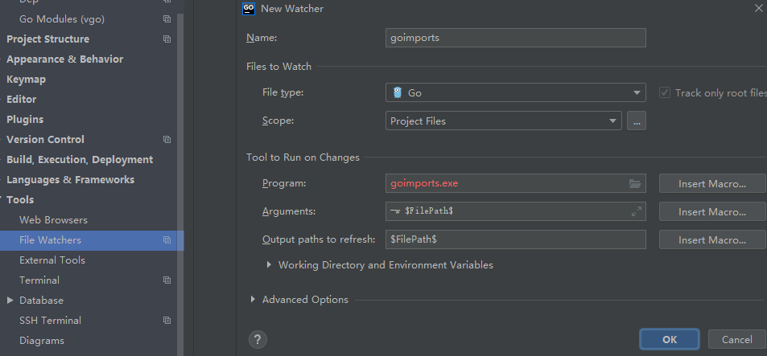

# go语言读书笔记

go语言接口更小,更倾向于定义一个单一的动作,而java习惯在接口中定义多个动作,
java中要求用户必须显式声明并实现User中所有的约束
```java
interface User {
    public void login()
    public void logout()
}
```

```go
type Reader interface {
    Read (p [] byte) (n int, err error)
}
```

### 配置环境
go env -w GOPROXY=https://goproxy.cn,direct 

> 使用go module
go env -w GO111MODULE=on

### 对于没有go.mod初始化

go mod init 项目名

### 安装goimports工具


> Many text editors can be configured to run gofmt each time you save a file, 
>so that your source code is always properly formatted. A related tool, goimports ,
> additionally manages the insertion and removal of import declarations as needed.
> It is not part of the standard distribution but you can obtain it with this command:
* go get -v golang.org/x/tools/cmd/goimports
* idea 中需要先安装 file watchers plugins



## go 语言的变量定义

#### 使用var关键字
    * var a,b,c bool 
    * var 可以在包内或者函数内
    * var 可以集中定义一批不同类型的变量
#### 使用类型自动推断(type deduction)
    * 可以省略掉type类型,go语言能根据右侧赋值自动推断
#### 使用:= 简化赋值
    * 只能在函数内部使用
    * 可以定义一批不同类型变量
    
* [feat:使用%q打印出空串 · macheng2017/go-learn@4740aac](https://github.com/macheng2017/go-learn/commit/4740aacf4ee01d65eeb46a48f70c82cddbbee33d)
* [feat:在使用自动类型推断的时候可以将不同类型的变量放到一行上进行赋值 · macheng2017/go-learn@a55f6d5](https://github.com/macheng2017/go-learn/commit/a55f6d5f8a0e88df3967a0e590c68e13fb4773ae)
* [feat:更简便的变量定义方式 := · macheng2017/go-learn@14a295a](https://github.com/macheng2017/go-learn/commit/14a295a7701a2ce1cb50f0a6b4f6d039cc191ce0)
* [feat: 这里作用域是包内部的 go语言没有全局变量 · macheng2017/go-learn@47e226a](https://github.com/macheng2017/go-learn/commit/47e226acdef39389b9e4d6bb748ce09c3315fcbf)
* [feat: 省略掉var的写法 · macheng2017/go-learn@fdc73b3](https://github.com/macheng2017/go-learn/commit/fdc73b3612bc0dd0303110ac15b80ae8cbfaf326)
* [feat: 省略掉var的写法 · macheng2017/go-learn@4322ea2](https://github.com/macheng2017/go-learn/commit/4322ea232e584914aef84ff25dea212d118cdfc2)

>https://golang.org/pkg
>
> the same code is part of the downloaded distribution. 
> Use this to figure out how something works, or to answer questions about details, 
> **or merely to see how experts write really good Go.**
> Brian W. Kernighan. The Go Programming Language (Addison-Wesley Professional Computing Series) (Kindle 位置 359-361). Addison-Wesley Professional. 


>blog.golang.org
>
 >publishes some of the best writing on Go, 
 with articles on the state of the language,
  plans for the future, reports on conferences, 
  and in-depth explanations of a wide variety of Go-related topics.
>Brian W. Kernighan. The Go Programming Language (Addison-Wesley Professional Computing Series) (Kindle 位置 343-345). Addison-Wesley Professional. 

go组织文件的方式package,类似其他语言的 lib  modules , 一个package包中有存放在***单个目录***的一个或者多个 
以.go结尾的源文件中构成,用来定义这个包的作用

> Go code is organized into packages,
> which are similar to libraries or modules in other languages.
> A package consists of one or more .go source files in a single directory that define what the package does.
> Brian W. Kernighan. The Go Programming Language (Addison-Wesley Professional Computing Series) (Kindle 位置 423-425). Addison-Wesley Professional. 

* 每个go文件第一行为package声明,表明当前go文件的归属于这个包
* 接下来是引入(imports)其他包的文件存储位置的声明


## 内建变量类型
* bool string
* 
(u)int
(u)int8
(u)int16
(u)int32
(u)int64
uintptr 指针
byte(1byte = 8bit)
rune 32位的go语言的char类型,char只有1字节(4byte是int32的一个别名)
float32
float64
complex64    复数
complex128
* [feat: 复数的写法 · macheng2017/go-learn@4587977](https://github.com/macheng2017/go-learn/commit/458797781c15461f87367ef3acea7b94547b027c)
* [feat: 验证欧拉公式 · macheng2017/go-learn@61f5bc8](https://github.com/macheng2017/go-learn/commit/61f5bc8ead18b0aa52808c338ac787da14b8578c)
* [feat: 验证欧拉公式 · macheng2017/go-learn@091e41f](https://github.com/macheng2017/go-learn/commit/091e41feacc007df63b654fb102f72fc623aee97)
* [feat: 验证欧拉公式,保留3位小数 · macheng2017/go-learn@6110d25](https://github.com/macheng2017/go-learn/commit/6110d25aef87fb279a2da4f092ad8687d13658db)

### go类型转换是强制的(显式)

* [feat: 在go中只有强制类型转换(显式转换) · macheng2017/go-learn@d817714](https://github.com/macheng2017/go-learn/commit/d817714c7013b186bf2b5810337f7a32aace02a7)
* [feat: // 现在的问题是,使用float会出现精度不够问题,即本来是一个整数,会出现小于这个整数的情况 · macheng2017/go-learn@5936e00](https://github.com/macheng2017/go-learn/commit/5936e00e972d411585bd81c9da5885ea35178814)

[golang - go float 精度丢失问题 - SegmentFault 思否](https://segmentfault.com/q/1010000015409775/)
[golang float64*float64 精度出现偏差要怎么解决啊?急急急急急急， - Golang 中国](https://www.golangtc.com/t/551cf5a8421aa9704b000070)

## 常量  
* const filename = "abc.txt"
* const a,b = 5,6
* const 数值可作为各种类型使用
* var c int = int(math.Sqrt(a*a + b*b))

* [feat: 常量的定义 · macheng2017/go-learn@a69388e](https://github.com/macheng2017/go-learn/commit/a69388e65be0475368148796740c2e2e6514727a)
很奇怪这里使用const常量之后,sqrt()中参数a,b不用强制转换?
这里a,b定义为常量之后类似文本替换,既可以做int也可以做float,所以不用强转

### 枚举类型(特殊的常量)
* 枚举类型直接定义为常量即可
* 自增枚举类型 iota

* [feat: 枚举类型直接定义为const即可 · macheng2017/go-learn@7a31020](https://github.com/macheng2017/go-learn/commit/7a3102006d03a8f74129cda15e108da3d41dccce)
* [feat: 枚举类型iota自增加 · macheng2017/go-learn@36dc4ed](https://github.com/macheng2017/go-learn/commit/36dc4ed517941c8ef8ff5d5a07b7f3a74b4aac69)
* [feat: 枚举类型iota 可以作为自增值的一个种子 · macheng2017/go-learn@ffe3034](https://github.com/macheng2017/go-learn/commit/ffe3034d9d2aa56c969282ba383709f65d1a01e8)
        > <<是左移动，自增是通过go语言的iota实现，iota开始是0，
        > 然后是1，2，3，4，参与运算之后变成1<<10,1<<20,1<<30，
        > 也就是10*1，10*2,然后左移动10位就是的10次方也就是1024
        
* [feat: 枚举类型iota 添加注释 · macheng2017/go-learn@b08c69b](https://github.com/macheng2017/go-learn/commit/b08c69bb4af002775e1041def45cb2899f27edd4)
## 变量总结
* 变量类型写在变量名之后
* 编译器可推测变量类型
* 没有char,只有rune
* 原生支持复数类型
